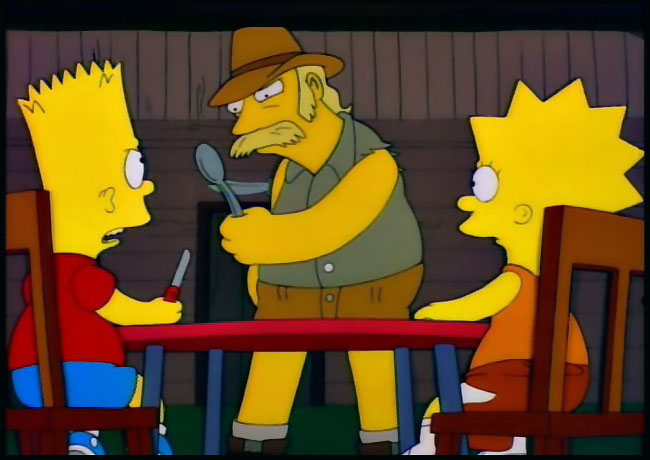
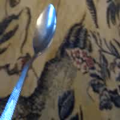

# The Knifey-Spoony Data-Set

[Original repository on GitHub](https://github.com/Hvass-Labs/knifey-spoony)

Original author is [Magnus Erik Hvass Pedersen](http://www.hvass-labs.org)

*"That's not a knife, that's a spoon!"*

## Introduction

* This is the Knifey-Spoony image data-set.
* The images show 3 types of objects: Cutlery knives, spoons and forks on a few different backgrounds.
* The classes are named: knifey, spoony and forky. (It's a spoof from The Simpsons on the 1980's movie Crocodile Dundee.)
* These images are used in [TensorFlow Tutorial #09](https://github.com/Hvass-Labs/TensorFlow-Tutorials/blob/master/08_Video_Data.ipynb) as an example of a classification problem.
* There is a [script](https://github.com/Hvass-Labs/TensorFlow-Tutorials/blob/master/convert.py) for converting videos to images so you can easily create your own data-set with thousands of images from just a few video-recordings.

## Images

* All images are 200 x 200 pixels with 3 colour channels.
* There is a total of 4700 jpg-images of which 530 are test-images with different backgrounds than the training-set.
* The knifey class has 1347 images total (137 images in the test-set).
* The spoony class has 2208 images total (242 images in the test-set).
* The forky class has 1145 images total (151 images in the test-set).

## Examples

  

## Installation

The archived tar-ball is automatically downloaded and extracted by using the [knifey.py](https://github.com/Hvass-Labs/TensorFlow-Tutorials/blob/master/knifey.py) module for Python.

## License (Public Domain)

This data-set is free to use for both academic and commercial purposes.

The picture from The Simpsons is used under the "fair use" laws.

The original author is not legally responsible for any consequences from using the data.

You are very welcome to include this data-set in other projects.
Please keep a link to the [original repository](https://github.com/Hvass-Labs/knifey-spoony).

